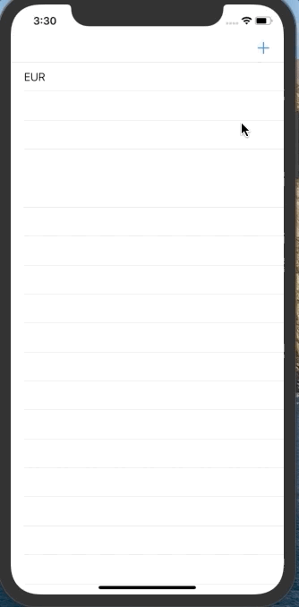

# CurrencyRates

## Requirements: 
* Xcode 11 
* Swift 5.0 +

## About:

## Screenshots:

## Used features:
* UIViewController
* UITableViewController
* UICollectionView
* Pull to refresh
* UISearchController
